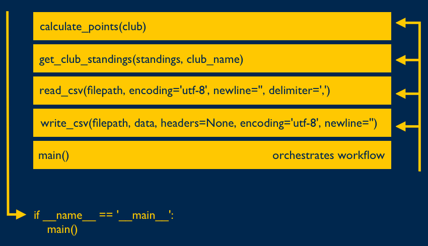

# SI 506 Lecture 13

## Topics

1. The main() function: controlling the flow of execution
2. Docstrings
3. Challenges

## Vocabulary

* __Flow of execution__. The order in which statements in a program are executed. Also referred to
   as _control flow_.
* __Truth Value__. In Python any object can be tested for its
  [truth value](https://docs.python.org/3/library/stdtypes.html#truth-value-testing) using an `if`
  or `while` condition or when it is used as an operand in a
  [Boolean operation](https://docs.python.org/3/library/stdtypes.html#boolean-operations-and-or-not).

### Previous

* __Argument__. A value passed to a function or method that corresponds to a parameter defined for
  the function or method.
* __Boolean__. A type (`bool`) or an expression that evaluates to either `True` or `False`.
* __Built-in Function__. A [function](https://docs.python.org/3/library/functions.html) defined by
  the Standard Library that is always available for use.
* __Caller__. The initiator of a function call.
* __Conditional Statement__. A statement that determines a computer program's _control flow_ or the
  order in which particular computations are to be executed.
* __Deep copying__. For a given mutable object (e.g., `list`) constructs a new compound object and
  recursively _copies_ into it objects found in the original.
* __Dictionary__. An associative array or a map, wherein each specified value is associated with or
  mapped to a defined key that is used to access the value.
* __Expression__. An accumulation of values, operators, and/or function calls that return a value.
  `len(< some_list >)` is considered an expression.
* __f-string__. Formatted string literal prefixed with `f` or `F`.
* __File Object__. An object that provides a file-oriented application programming interface
  (API) to a either a text file, binary file (e.g., image file), or a buffered binary file. File
  objects include read and write methods for interacting with a file stored locally or remotely.
* __Function__. A defined block of code that performs (ideally) a single task. Functions only run
  when they are explicitly called. A function can be defined with one or more _parameters_ that
  allow it to accept _arguments_ from the caller in order to perform a computation. A function can
  also be designed to return a computed value. Functions are considered "first-class" objects in the
  Python eco-system.
* __Immutable__. Object state cannot be modified following creation. Strings are immutable.
* __Iterable__. An object capable of returning its members one at a time. Both strings and lists are
  examples of an iterable.
* __Iteration__. Repetition of a computational procedure in order to generate a possible sequence of
  outcomes. Iterating over a `list` using a `for` loop is an example of iteration.
* __Method__. A function defined by and bound to an object. For example the `str` type is
  provisioned with a number of methods including `str.strip()`.
* __Mutable__. Object state can be modified following creation. Lists are mutable.
* __Nested Loop__. A `for` or `while` loop located within the code block of another loop.
* __Operator__. A [symbol](https://www.w3schools.com/python/python_operators.asp) for performing
  operations on values and variables. The assignment operator (`=`) and arithmetic operators
  (`+`, `-`, `*`, `/`, `**`, `%`, `//`).
* __Parameter__. A named entity in a function or method definition that specifies an argument that
  the function or method accepts.
* __Scope__. The part of a script or program in which a variable and the object to which it is
  assigned is visible and accessible.
* __Sequence__. An ordered set such as `str`, `list`, or `tuple`, the members of which (e.g.,
  characters, elements, items) can be accessed.
* __Shallow copying__. For a given mutable object (e.g., `list`) constructs a new compound object
  but inserts _references_ (rather than copies) into it of objects found in the original. The
  `list.copy()` returns a shallow copy of the original list.
* __Slice__. A subset of a sequence. A slice is created using the subscript notation `[]` with
  colons separating numbers when several are given, such as in `variable_name[1:3:5]`. The bracket
  notation uses slice objects internally.
* __Statement__. An instruction that the Python Interpreter can execute. For example, assigning a
  variable to a value such as `name = 'arwhyte'` is considered a statement.
* __Tuple__. An ordered sequence that cannot be modified once it is created.
* __Tuple packing__. Assigning items to a tuple.
* __Tuple unpacking__. Assigning tuple items to an equal number of variables in a single assignment.
  A `list` can also be unpacked.

## Data

This week's data features two datasets:

1. English Premier League standings for the [2020-21 season](https://bit.ly/3nDkdvw). Each club's
   win, draw, loss, goals for, goals against, etc. data is stored in the file
   `english_premier_league-2020-21.csv`.
2. Club information (e.g., full name, nicknames, home grounds, stadium capacity, region). The data
   is stored in `english_clubs.csv`.

## 1.0 The main() function: controlling the flow of execution

Python features _two_ file execution modes. Code in a file can be executed as a script from the
command line or the code can be imported into another Python file for use.

If a Python program is executed as a script from the command line the Python interpreter will
run the file under the special name of `__main__` rather than the program's actual file name (e.g.,
`lecture_13.py`).

Given this naming behavior we can choose the program's entry point and control the
program's execution flow by directing the Python interpreter to call the `main()` function _first_
in order to execute the statements defined in its code block.

In the following example, the `main()` function's code block manages the program's control flow.

<br />
    
<br />

The flow of execution might be imagined as follows:

1. The Python interpreter reads the file, registering in memory the functions it encounters.
2. Since the program is run as a script from the command line, the conditional statement
   `if __name__ == '__main__'` evaluates to `True`, and the `main()` function, serving as the
   program's entry point, is called.
3. The `read_csv()` function is then called in order to retrieve the data.
4. The `get_club_standings()` function is then called in order to return a club record (wins,
   losses, draws, and goals for and against) for a given season.
5. The `calculate_points()` function is then called in order to compute the total points earned by
   the club during the season. In `main()` this function could be called from within a loop in
   order to compute the total points earned for each club.
6. The `write_csv()` function could then be called to write the modified data to a `*.csv` file.

### 1.1 Why `main()`?

Employing a `main()` function to manage your program's flow of execution keeps separate the
code you write to manage a program's work flow from the code you write to perform specific tasks
(e.g., functions). This encourages code modularization and, by relying on function calls to perform
specific tasks, helps to eliminate code duplication.

An important side benefit is that with the work flow code restricted to `main()` the other objects
comprising the file (e.g., functions, classes, constants) can be imported as a module into another
Python module without triggering the code located in `main()`. This can occur because module code
imported from one Python file into another Python file is known by the Python interpreter by the
module's actual file name and not by the name `__main__` as is the case with scripts run from the
command line.

:bulb: We will cover modules, module imports, and execution modes in more detail _after_ the
midterm.

## 2.0 Docstrings

The Python documentation string or [Docstring](https://www.python.org/dev/peps/pep-0257/) is a
string literal that is positioned as the first statement in a function. The Docstring provides a
short summary of the function's expected behavior, including details regarding defined parameters
(required and optional) and return value, if any. The Python interpreter assigns the string to the
special "dunder" `__doc__` object attribute. Docstrings can also be assigned to modules, classes,
and class methods, examples of which you will encounter later in the course.

There are two forms of Docstrings: single line and multi-line statements. Single line Docstrings are
reserved for describing obvious behaviors. For example, the built-in `len()` function is described
with a single line Docstring:

```commandline
>>> len.__doc__
'Return the number of items in a container.'
```

The Docstrings in functions and other objects that you will encounter in this
course will resemble a specially formatted multiline strings bounded by triple quotation marks
(`"""`).

The Docstring format we use is as follows:

```python
"""Short description describing the purpose and expected behavior of the function. Between one
and five sentences should suffice to describe the function in all its glory.

Parameters:
    < name > (< type >): Terse description of the parameter.
    . . . [Repeat for each parameter, required and optional]

Returns:
    < type >: Terse description of the return value. If no value is explicitly returned use `None`.
"""
```

We will make increasing use of Docstrings in both lectures, labs, problem sets and lab exercises,
the midterm, and the last assignment in order to describe a function's purpose, define parameters
and indicate an explicit return value, if any.

## 3.0 Challenges

### 3.1 Challenge 02

__Task__: Read the English Premier League (EPL) 2020-2021 standings and club info files.

1. From `main()` call the function `read_csv` and retrieve the EPL standings data. Assign the return
   value to a variable named `standings_data`.

2. Extract the headers and assign to a variable named `headers`.

3. Extract the club standings and assign to a variable named `standings`.

4. Implement the function `clean_data()` so that it can convert all numbers
   masquerading as strings to integers. Read the Docstring for more information.

5. Return to `main()` and call `clean_data` and pass to it `standings_data` as the argument. Assign
   the return value to a variable named `standings`.

### 3.2 Challenge 02

__Task__: Add data to `standings` sourced from `english_clubs.csv`.

1. From `main()` call the function `read_csv` and retrieve the club info data. Assign the return
   value to a variable named `club_info_data`.

2. Extract the headers and assign to a variable named `club_info_headers`.

3. Extract the club info and assign to a variable named `club_info`.

4. Insert two new header values ("ground" and "capacity") into the standings `headers` list in the
   third (3rd) and fourth (4th) positions in the each nested club list.

5. For each club list in `standings` insert the ground and capacity values found in the `club_info`
   list in the third and fourth positions respectively.

   bulb: Consider implementing a nested loop. Review both data sets to determine a "column" that
   will allow for the club info to be joined to the club standings.

   The modified nested club lists will now resemble the following list that represents Arsenal:

   ```python
   ['Arsenal', 'Islington (North London)', 'Emirates Stadium', '60704', 38, 18, 7, 13, 55, 39]
   ```

### 3.3 Challenge 03

__Task__: Read the `get_club_standings()` Docstring and implement the function.

1. Implement the function `get_club_standings()`. Read the Docstring for more information.

2. From `main()` call the function and pass to it the `standings` list and the
   string `liverpool` as arguments. Assign the return value to the variable named `liverpool`.

### 3.4 Challenge 04

__Task__: Calculate the total points earned by each club during the 2020-21 season. Assign the
points earned to each club's nested `standings` list.

1. Implement the function `calculate_points()`. Read the Docstring for more information.

   :bulb: The function can be implemented with one line of code.

2. From `main()`, append a new header to the `headers` list named 'points'.

3. Then loop over `standings` and for each club compute the points earned and
   append the points to the nested club list.

4. Then retrieve Chelea's standings from the `standings` employing a function
   implemented in a previous challenge. Assign the return value to a variable
   named `chelsea`.

5. Then retrieve Chelsea's points using indexing (leverage the headers and perform a lookup of the index value) and assign the return value to a variable
named `chelsea_points`

### 3.5 Challenge 05

__Task__: Return all club standings located in the West Midlands.

1. Implement the function `get_region`. Read the Docstring for more information.

2. From `main()` create an empty accumulator list named `west_midland_clubs`.

3. Loop over each club's standings. For each club retrieve their region from the `club_info` list by
   calling the function `get_region`. Then check the return value. If it is `West Midlands` append
   the club's name to `west_midland_clubs`.

### 3.6 Challenge 06 (Bonus)

__Task__: Return a list of club standings sorted by points (descending).

1. Review the function `determine_place`.

1. From `main`() uncomment the Challenge 05 code and run the lecture_13.py. Check the output
   streamed to the terminal.
