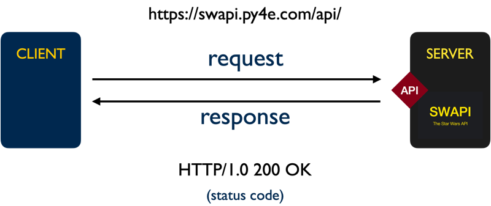

# SI 506 Lecture 18

## Goals

1. Understand the basics of the HTTP request/response communication cycle.
2. Learn about JSON and how to leverage the Python `json` module.
3. Write utility functions that leverage the requests and json libraries in order to retrieve SWAPI
   resources, decode/encode JSON documents and write a JSON document to a file.
4. Challenges

## Vocabulary

* __API__: Application Programming Interface that species a set of permitted interactions between
  systems.
* __HTTP__: The Hypertext Transport Protocol is an application layer protocol designed to facilitate
  the distributed transmission of hypermedia. Web data communications largely depends on HTTP.
* __JSON__: Javascript Object Notation, a lightweight data interchange format.
* __Querystring__: That part of a Uniform Resouce Locator (URL) that assigns values to specified
  parameters.
* __Resource__: A named object (e.g., document, image, service, collection of objects) that is both
  addressable and accessible via an API.
* __URI__: Uniform Resource Identifier that identifies unambiguously a particular resource.
* __URL__: Uniform Resource Locator is a type of URI that specifies the _location_ of a resource on
  a network and provides the means to retrieve it.
* __URN__: Uniform Resource Name is a type of URI that provides a unique identifier for a resource
  but does not specify its location on a network.

### Previous

* __Argument__. A value passed to a function or method that corresponds to a parameter defined for
  the function or method.
* __Boolean__. A type (`bool`) or an expression that evaluates to either `True` or `False`.
* __Built-in Function__. A [function](https://docs.python.org/3/library/functions.html) defined by
  the Standard Library that is always available for use.
* __Caller__. The initiator of a function call.
* __Conditional Statement__. A statement that determines a computer program's _control flow_ or the
  order in which particular computations are to be executed.
* __Deep copying__. For a given mutable object (e.g., `list`) constructs a new compound object and
  recursively _copies_ into it objects found in the original.
* __Dictionary__. An associative array or a map, wherein each specified value is associated with or
  mapped to a defined key that is used to access the value.
* __Expression__. An accumulation of values, operators, and/or function calls that return a value.
  `len(< some_list >)` is considered an expression.
* __f-string__. Formatted string literal prefixed with `f` or `F`.
* __File Object__. An object that provides a file-oriented application programming interface
  (API) to a either a text file, binary file (e.g., image file), or a buffered binary file. File
  objects include read and write methods for interacting with a file stored locally or remotely.
* __Flow of execution__. The order in which statements in a program are executed. Also referred to
   as _control flow_.
* __Function__. A defined block of code that performs (ideally) a single task. Functions only run
  when they are explicitly called. A function can be defined with one or more _parameters_ that
  allow it to accept _arguments_ from the caller in order to perform a computation. A function can
  also be designed to return a computed value. Functions are considered "first-class" objects in the
  Python eco-system.
* __Immutable__. Object state cannot be modified following creation. Strings are immutable.
* __Iterable__. An object capable of returning its members one at a time. Both strings and lists are
  examples of an iterable.
* __Iteration__. Repetition of a computational procedure in order to generate a possible sequence of
  outcomes. Iterating over a `list` using a `for` loop is an example of iteration.
* __Method__. A function defined by and bound to an object. For example the `str` type is
  provisioned with a number of methods including `str.strip()`.
* __Mutable__. Object state can be modified following creation. Lists are mutable.
* __Nested Loop__. A `for` or `while` loop located within the code block of another loop.
* __Operator__. A [symbol](https://www.w3schools.com/python/python_operators.asp) for performing
  operations on values and variables. The assignment operator (`=`) and arithmetic operators
  (`+`, `-`, `*`, `/`, `**`, `%`, `//`).
* __Parameter__. A named entity in a function or method definition that specifies an argument that
  the function or method accepts.
* __Scope__. The part of a script or program in which a variable and the object to which it is
  assigned is visible and accessible.
* __Sequence__. An ordered set such as `str`, `list`, or `tuple`, the members of which (e.g.,
  characters, elements, items) can be accessed.
* __Shallow copying__. For a given mutable object (e.g., `list`) constructs a new compound object
  but inserts _references_ (rather than copies) into it of objects found in the original. The
  `list.copy()` returns a shallow copy of the original list.
* __Slice__. A subset of a sequence. A slice is created using the subscript notation `[]` with
  colons separating numbers when several are given, such as in `variable_name[1:3:5]`. The bracket
  notation uses slice objects internally.
* __Statement__. An instruction that the Python Interpreter can execute. For example, assigning a
  variable to a value such as `name = 'arwhyte'` is considered a statement.
* __Truth Value__. In Python any object can be tested for its
  [truth value](https://docs.python.org/3/library/stdtypes.html#truth-value-testing) using an `if`
  or `while` condition or when it is used as an operand in a
  [Boolean operation](https://docs.python.org/3/library/stdtypes.html#boolean-operations-and-or-not).
* __Tuple__. An ordered sequence that cannot be modified once it is created.
* __Tuple packing__. Assigning items to a tuple.
* __Tuple unpacking__. Assigning tuple items to an equal number of variables in a single assignment.
  A `list` can also be unpacked.

## 1.0 HTTP Request/Response cycle

The `swapi_test.py` script utilizes the `requests` module to send a message (known as a _request_)
to a remote server. The message is sent over HTTP (Hypertext Transfer Protocol), an application
layer protocol that supports data exchange between clients and servers. The server replies with a
message (known as a _response_). If the client is authorized to access the requested data (known
as a _resource_) identified by the provided Uniform Resource Identifier (in our case a URL) the
response will contain a representation of the resource, usually in the form of a JSON document.

HTTP and its extension HTTPS (Hypertext Transfer Protocol Secure) rely on lower level transport
layer protocols such as the Transmission Control Protocol (TCP) or the User Datagram Protocol (UDP)
to transmit packets of data between a client and a server. TCP privileges reliable
message delivery over speed and requires the server to acknowledge the receipt of data and permit
retransmission. UDP privileges speed over reliability and offers no guarantee of message delivery.
Exchanging messages with SWAPI leverages HTTPS over TCP and the still lower-level Internet Protocol
(IP).

An HTTP request consists of an HTTP verb (e.g., `GET`), a resource identifier (e.g.,
`https://swapi.py4e.com/api/people/10/`), the protocol version (`HTTP/1.1`) and optional headers and
an optional body (itself a resource). An HTTP response consists of the protocol version, status code
(e.g., `200`), status message (e.g., `OK`), headers, and an optional body (the requested resource).

The HTTP request methods utilized most frequently include `GET`, `PUT`, `POST`, and `DELETE`.
Other HTTP methods include `CONNECT`, `HEAD`, `OPTIONS`, `PATCH` and `TRACE`.

:bulb: For SI 506 you need only concern yourself with the `GET` method.

<br />
    
<br />

The Python [requests](https://docs.python-requests.org/) package abstracts away much of the
complexity associated with creating an HTTP request. In the case of `swapi_test.py` we need only
pass a URL to the `request` library's `get()` function to initiate a valid HTTP `GET` request. The
`get()` function's return value is an instance of `request.Response`, an object which contains the
JSON-encoded representation of the requested resource. We can access the `response.text` property
to return the JSON documents as a string. Better yet, we can call the `response.json()` method in
order to decode the JSON document into a dictionary.

## 2.0 JSON

SWAPI responds to a resource request with a message encoded as a JSON (JavaScript Object Notation)
document. JSON is a lightweight data interchange format for exchanging information between systems.

JSON consists of two basic data structures and several value types:

## 2.1 JSON data structures

1. An _unordered_ set of key-value pairs known as an _object_ and denoted by curly braces (`{}`).
2. An _ordered_ list of values known as an _array_ and denoted by square brackets (`[]`).

## 2.2 JSON value types

1. string
2. number
3. boolean
4. array `[]`
5. object `{}`
6. null

## 2.3 JSON example

```json
{
  "url": "https://swapi.co/api/people/10/",
  "name": "Obi-Wan Kenobi",
  "height": 182,
  "mass": 77.5,
  "hair_color": ["auburn", "white"],
  "eye_color": "blue-gray",
  "birth_year": "57BBY",
  "homeworld": {
    "url": "https://swapi.co/api/planets/20/",
    "name": "Stewjon",
    "climate": "temperate",
    "population": null
  },
  "is_jedi": true
}
```

## 3.0 json module

Like the `csv` module the Python standard libary's `json` module provides enhanced functionality for
working with JSON files. JSON is a lightweight data interchange format for exchanging information
between systems.

To use the `json` module you must import it in your Python file:

```python
import json
```

There are four `json` module functions; two of which are of particular interest to us:

1. __`json.load()`__ -- _deserializes_ (decodes) a text or binary file that contains a JSON document
   to a `dict` or `list`.
2. `json.loads()` -- _deserializes_ (decodes) a string, bytes, or bytearry containing a JSON
   document to a `dict` or `list`.
3. __`json.dump()`__ -- _serializes_ (encodes) an object as a JSON formatted stream to be stored in
   a file.
4. `json.dumps()` -- _serializes_ (encodes) an object to a JSON formatted string.

Since you will also be working with JSON documents between now and the end of the semester
implmenting a function that can read a JSON document as well one that can write a JSON document to
a file will prove useful.

## 3.1 Reading JSON files (`json_load()`)

The function `read_json()` reads a JSON document per the provided filepath, calls the json module's
`json.load()` function in order to _decode_ the file data as a `dict` or a `list` (of dictionaries),
and returns the decoded data to the caller.

```python
def read_json(filepath, encoding='utf-8'):
    """Reads a JSON document, decodes the file content, and returns a list or
    dictionary if provided with a valid filepath.

    Parameters:
        filepath (str): path to file
        encoding (str): name of encoding used to decode the file

    Returns:
        dict/list: dict or list representations of the decoded JSON document
    """

    with open(filepath, 'r', encoding=encoding) as file_obj:
        return json.load(file_obj)
```

## 3.2 Writing to a JSON file (`json_dump()`)

The function `write_json()` accepts a dictionary or a list of dictionaries, calls the json module's
`json.dump()` function in order to _encode_ the passed in data as JSON, and writes the encoded data
to the target file.

```python
def write_json(filepath, data, encoding='utf-8', ensure_ascii=False, indent=2):
    """Serializes object as JSON. Writes content to the provided filepath.

    Parameters:
        filepath (str): the path to the file
        data (dict)/(list): the data to be encoded as JSON and written to the file
        encoding (str): name of encoding used to encode the file
        ensure_ascii (str): if False non-ASCII characters are printed as is; otherwise
                            non-ASCII characters are escaped.
        indent (int): number of "pretty printed" indention spaces applied to encoded JSON

    Returns:
        None
    """

    with open(filepath, 'w', encoding=encoding) as file_obj:
        json.dump(data, file_obj, ensure_ascii=ensure_ascii, indent=indent)
```

## 4.0 Challenges

## 4.1 Challenge 01

__Task__: Retrieve a SWAPI representation of Chewbacca and supplement representation with
homeland and species data.

1. In `main` call the function `get_swapi_resource` passing the search string "chewbacca" and
   retrieve a response that contains a representation of the Wookiee Chewbacca (a.k.a Chewie).
   Assign the return value to a variable named response.

   :exclamation: The JSON response that is decoded into a dictionary is structured as follows:

   ```json
   {
     'count': 1,
     'next': None,
     'previous': None,
     'results': [
       {< Chewbacca >}
     ]
   }

   ```

2. Access the Chewbacca dictionary and assign it to variable named `chewie`.

3. Call the function `write_json` and write `chewie` to a file named `chewie.json`.

4. Access the `homeworld` URL in `chewie` and retrieve the Wookiee's home plant by
   calling `get_swapi_resource` and passing the URL to it as an argument (no search string
   required). Assign the return value to `chewie['homeworld']`.

5. Access the `species` URL in `chewie` and retrieve the Wookiee's species by
   calling `get_swapi_resource` and passing the URL to it as an argument (no search string
   required). Assign the return value to `chewie['species']`.

   :exclamation: note that the value of `chewie['species']` is a `list`.

6. Call the function `write_json` and write `chewie` to a file named `chewie_enriched.json`.

## 4.2 Challenge 02

__Task__: Implement the function `drop_data`. Refer to the Docstring for more information. Utilize
the `drop_keys` tuple to thin SWAPI entities of unneeded key-value pairs.

1. After implementing the function return to `main`. Call `get_swapi_resource` and retrieve a
   dictionary representation of a __T-65 X-wing__ starfighter. Assign the return value to a
   variable named `x_wing`.

   :bulb: employ the search string "t-65 x-wing" rather than "x-wing" as there are two models of
   X-wing starfighters available for retrieval.

2. Call the function `drop_data` passing to it as arguments `x_wing` and `drop_keys`. Assign the
   return value to `x_wing`.

3. Call the function `write_json` and write `x_wing` to a file named `x_wing.json`.

## 4.3 Challenge 03

__Task__: Combine the T-65 X-wing data sourced from [Wookieepedia](https://starwars.fandom.com/) and
contained in the file  `wookieepedia_starships.csv` with the SWAPI `x_wing` dictionary.

1. Call `read_csv_to_dicts` and retrieve the Starfighter data sourced from Wookieepedia. Assign the
   list of dictionaries to the variable named `wookiee_starships`.

2. Access the T-65 Starfighter dictionary in `wookiee_starships` and assign to a variable named
   `woookiee_x_wing`.

3. Update `x_wing` with `wookiee_x_wing`.

   :bulb: Visit w3school's
   ["Python Dictionary Methods"](https://www.w3schools.com/python/python_ref_dictionary.asp) page;
   there is a handy `dict` method available to accomplish this task.

4. call the function `write_json` and write `x_wing` to a file named
   `x_wing_enriched.json`.

## 4.4 Challenge 04

__Task__: Replace the `x_wing` pilot URLs with dictionary representations of each pilot.
When adding the pilot dictionaries to `x_wing` remove unneeded key-value pairs.

:bulb: leverage the `range` object to solve this challenge.

1. Utilize a `for` loop to update the `x_wing` `pilots` list. For each pilot call
   `get_swapi_resource` to retrieve the pilot. Drop unneeded key-value pairs and assign the return
   value to `pilot`.

   1. Then retrieve the pilot's home planet, drop unneeded key-value pairs and assign the return
      value to the pilot's `homeworld` key.

   2. Also retrieve the pilot's species&mdash;_if species data exists_&mdash; drop unneeded
      key-value pairs and assign the return value to the pilot's `species` key.

   3. Finally, assign the `pilot` to the appropriate `x_wing['pilots']` list element.

2. After updating `x_wing` call the function `write_json` and write `x_wing` to a
   file named `x_wing_pilots.json`.

## 4.5 Challenge 05

__Task__: Drop the `x_wing` `pilots` key-value pair. Retrieve Luke Skywalker and the astromech
droid R2-D2 from SWAPI. Add `homeworld` and `species` dictionaries. Drop all unneeded key-value
pairs for person, droid, home planet and species. Assign Luke and R2-D2 as the `x_wing` crew
members.

1. Drop the `x_wing` `pilots` key-value pair. Pass __a single item tuple__ to `drop_data` to
   accomplish the task.

2. Retrieve a SWAPI representation of Luke Skywalker. Drop unneeded key-value pairs. Assign the
   return value to a variable named `luke`.

3. Retrieve Luke's home planet and species. Drop unneeded key-value pairs for each. Assign to
   the `homeworld` and `species` keys in `luke`.

4. Retrieve a SWAPI representation of R2-D2. Repeat the same steps performed for Luke, i.e.,
   drop unneeded key-value pairs, retreive `homeworld` and `species` data. Assign the return value to a variable named `r2`.

5. Create a dictionary with two key-value pairs: `pilot` and `astromech_droid`. Assign `luke`
   and `r2` as values and assign to `luke` using the new key `crew_members`.

6. Call the function `write_json` and write `x_wing` to a file named `x_wing_crew.json`.
