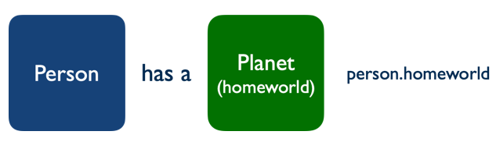

# SI 506: Lecture 19

## Topics

1. The Python class
2. Defining a class
3. Instantiating a class
   1. The class constructor and the role of `self`
4. Representing a class instance as a string
5. Accessing instance variables
6. Defining instance methods
   1. Calling instance methods
7. Converting a custom object to a JSON-friendly dictionary
8. Composition
   1. Challenge

## Vocabulary

* __Class__: "A template for creating user-defined objects. Class definitions normally contain
  method definitions which operate on instances of the class."
  [Python Official Documentation](https://docs.python.org/3/glossary.html).
* __Composition__: Pattern that involves combining object types in order to create a _composite_
  type that models a "has a" relationship between the composite and one or more _component_ objects
  (e.g., `Automobile` has an `Engine`; `Bicycle` has a `Crankset`, `Handlebar`, `Wheelset`,
  `Pedal` (2x), `Seat`, etc.).
* __Instance__: An individual object whose type is defined by the class by which it was
  instantiated or created.
* __Instance variable__: An variable and value bound to a specific instance of a class.
* __Instance method__: A function defined by a class and bound to a specific instance of a class.
* __self__: A variable that represents an instance of a class.

### Previous

* __API__: Application Programming Interface that species a set of permitted interactions between
  systems.
* __Argument__. A value passed to a function or method that corresponds to a parameter defined for
  the function or method.
* __Boolean__. A type (`bool`) or an expression that evaluates to either `True` or `False`.
* __Built-in Function__. A [function](https://docs.python.org/3/library/functions.html) defined by
  the Standard Library that is always available for use.
* __Caller__. The initiator of a function call.
* __Conditional Statement__. A statement that determines a computer program's _control flow_ or the
  order in which particular computations are to be executed.
* __Deep copying__. For a given mutable object (e.g., `list`) constructs a new compound object and
  recursively _copies_ into it objects found in the original.
* __Dictionary__. An associative array or a map, wherein each specified value is associated with or
  mapped to a defined key that is used to access the value.
* __Expression__. An accumulation of values, operators, and/or function calls that return a value.
  `len(< some_list >)` is considered an expression.
* __f-string__. Formatted string literal prefixed with `f` or `F`.
* __File Object__. An object that provides a file-oriented application programming interface
  (API) to a either a text file, binary file (e.g., image file), or a buffered binary file. File
  objects include read and write methods for interacting with a file stored locally or remotely.
* __Flow of execution__. The order in which statements in a program are executed. Also referred to
   as _control flow_.
* __Function__. A defined block of code that performs (ideally) a single task. Functions only run
  when they are explicitly called. A function can be defined with one or more _parameters_ that
  allow it to accept _arguments_ from the caller in order to perform a computation. A function can
  also be designed to return a computed value. Functions are considered "first-class" objects in the
  Python eco-system.
* __HTTP__: The Hypertext Transport Protocol is an application layer protocol designed to facilitate
  the distributed transmission of hypermedia. Web data communications largely depends on HTTP.
* __Immutable__. Object state cannot be modified following creation. Strings are immutable.
* __Iterable__. An object capable of returning its members one at a time. Both strings and lists are
  examples of an iterable.
* __Iteration__. Repetition of a computational procedure in order to generate a possible sequence of
  outcomes. Iterating over a `list` using a `for` loop is an example of iteration.
* __JSON__: Javascript Object Notation, a lightweight data interchange format.
* __Method__. A function defined by and bound to an object. For example the `str` type is
  provisioned with a number of methods including `str.strip()`.
* __Mutable__. Object state can be modified following creation. Lists are mutable.
* __Nested Loop__. A `for` or `while` loop located within the code block of another loop.
* __Operator__. A [symbol](https://www.w3schools.com/python/python_operators.asp) for performing
  operations on values and variables. The assignment operator (`=`) and arithmetic operators
  (`+`, `-`, `*`, `/`, `**`, `%`, `//`).
* __Parameter__. A named entity in a function or method definition that specifies an argument that
  the function or method accepts.
* __Querystring__: That part of a Uniform Resouce Locator (URL) that assigns values to specified
  parameters.
* __Resource__: A named object (e.g., document, image, service, collection of objects) that is both
  addressable and accessible via an API.
* __Scope__. The part of a script or program in which a variable and the object to which it is
  assigned is visible and accessible.
* __Sequence__. An ordered set such as `str`, `list`, or `tuple`, the members of which (e.g.,
  characters, elements, items) can be accessed.
* __Shallow copying__. For a given mutable object (e.g., `list`) constructs a new compound object
  but inserts _references_ (rather than copies) into it of objects found in the original. The
  `list.copy()` returns a shallow copy of the original list.
* __Slice__. A subset of a sequence. A slice is created using the subscript notation `[]` with
  colons separating numbers when several are given, such as in `variable_name[1:3:5]`. The bracket
  notation uses slice objects internally.
* __Statement__. An instruction that the Python Interpreter can execute. For example, assigning a
  variable to a value such as `name = 'arwhyte'` is considered a statement.
* __Truth Value__. In Python any object can be tested for its
  [truth value](https://docs.python.org/3/library/stdtypes.html#truth-value-testing) using an `if`
  or `while` condition or when it is used as an operand in a
  [Boolean operation](https://docs.python.org/3/library/stdtypes.html#boolean-operations-and-or-not).
* __Tuple__. An ordered sequence that cannot be modified once it is created.
* __Tuple packing__. Assigning items to a tuple.
* __Tuple unpacking__. Assigning tuple items to an equal number of variables in a single assignment.
  A `list` can also be unpacked.
* __URI__: Uniform Resource Identifier that identifies unambiguously a particular resource.
* __URL__: Uniform Resource Locator is a type of URI that specifies the _location_ of a resource on
  a network and provides the means to retrieve it.
* __URN__: Uniform Resource Name is a type of URI that provides a unique identifier for a resource
  but does not specify its location on a network.

## 1.0 The class

The Python class is a beautiful thing. When you define a class, say `Person`, you provide a
blueprint, a template, or better yet, a model comprising attributes and methods that objects based
on the class are provisioned with when created or instantiated.

Designing custom classes allows you to _instantiate_ (i.e., create) multiple objects of the same
type.

## 2.0 Defining a `class`

Use the `class` keyword to define a class. The name of the class _should) employ "CamelCase" styling
using one or more nouns.

```python
class Person:
    """Representation of a Person."""

    pass # TODO Implement
```

## 3.0 Instantiating a class

Instantiating a class or creating an instance of a class is similar to calling a function and
assigning a return value to a variable.

```python
person = Person()
```

:exclamation: `class` is a reserved word and therefore is ineligble for use as a variable. If you
need a class-like name utilize `clazz`.

## 3.1 The class constructor and the role of `self`

In most cases instantiating a class instance requires passing in one or more required attributes.
A special "dunder" `__init__()` method is used to accomplish the task. Optional parameters with
default values can also be defined.

:exclamation: Unlike other languages, Python requires that the object instance of a class be
referenced _explicitly_ whenever accessing instance variables or calling instance methods that are
_bound_ to the class instance. Python community practice is to refer to the class instance as
`self`. When defining a class, each variable assignment involving an instance variable _must_ be
prefixed by `self` using dot notation (`.`). Method calls _must_ also be prefixed by `self` using
dot notation (`.`). In addition, when defining a method, `self` _must_ always be listed as a
parameter and positioned _first_ in the parameter list.

In the example below the `Person` class `__init__()` method defines five (5) instance variables
(in addition to `self`), four of
which&mdash;`url`, `name`, `birth_year`, and `force_sensitive`&mdash;are required when instantiating
an instance of `Person`. The fourth instance variable `homeworld` is considered optional and is not
specified in the parameter list.

:bulb: instance variables can also be provisioned with default values as is the case with
`force_sensitive`.

```python
class Person:
    """Representation of a person.

    Attributes:
        url (str): uniform resource locator
        name (str): person name
        birth_year (str): person's birth_year
        force_sensitive (bool): ability to harness the power of the Force
        homeworld (Planet): person's home planet

    Methods:
        get_homeworld: retrieve home planet
        jsonable: return JSON-friendly dict representation of the object
    """

    def __init__(self, url, name, birth_year, force_sensitive=False):
        """Initialize Person instance.

        Parameters:
            url (str): uniform resource locator
            name (str): person name
            birth_year (str): person's birth_year
            force_sensitive (bool): ability to harness the power of the Force

        Returns:
           Person: person instance
        """

        self.url = url
        self.name = name
        self.birth_year = birth_year
        self.force_sensitive = force_sensitive
        self.homeworld = None
```

The example below illustrates instantiating an instance of `Person` from data sourced from SWAPI.

```python
# Get Yoda data
swapi_yoda = get_swapi_resource(f"{endpoint}/people", {'search': 'yoda'})['results'][0]

# Instantiate Person
yoda = Person(swapi_yoda['url'], swapi_yoda['name'], swapi_yoda['birth_year'])
```

:bulb: Multiple `Person` instances can be created by looping over the `data` and storing each
instance in a list.

```python
people = [] # accumulator

# Get first 10 people from SWAPI
swapi_people = get_swapi_resource(f"{endpoint}/people")['results'] # returns list of people

# Append Person instances to list
for person in swapi_people:
    people.append(Person(person['url'], person['name'], person['birth_year']))
```

## 4.0 Representing a class instance as a string

You can return a `str` representation of a class instance by adding a "dunder" or "magic `__str__()`
method to the the class definition. The method returns a human-friendly string representation of the
object of your own design. Implementing the `__str__()` method is considered a best practice and avoids
returning the largely opaque string that provides only the object's internal identifier (e.g.,
`<__main__.Person object at 0x10079cd00>`) when passing the object to the built-in
`print()` function (e.g., `print(yoda)`).

```python
def __str__(self):
    """Return a string representation of the object."""

    return self.name
```

## 5.0 Accessing instance variable values

Instance variables (i.e., object attributes)) are accessed using dot notation (`.`).

```python
birth_year = yoda.birth_year
is_force_sensitive = yoda.force_sensitive
```

## 6.0 Defining instance methods

You can define one or more instance methods that can be called once a class is instantiated. At a
minimum, `self` _must_ be defined as a parameter but other parameters can also be defined including
optional parameters.

The example `Person` method `get_age` provides the caller with the ability to calculate the age of a
person in relation to the current era and year.

:bulb: determining the age of person is complicated by the fact that births and deaths can span two
calendar eras: the BBY era (Before the Battle of Yavin) and the ABY (After the Battle of Yavin) era
with the BBY years listed continuously in reverse order (largeest to smallest) while the ABY years
are listed continuously in regular order (smallest to largest).

```python
def get_age(self, current_era, current_year):
    """Returns age of person in relation to the passed in current era
    (BBY or ABY only) and year. The BBY era (Before the Battle of Yavin) is
    a retrospective calendar and the integer values denoting the
    years are listed continuously in reverse order from largest to smallest
    as each relates to battle (0 BBY). The ABY era (After the Battle of Yavin)
    commences in the year following the battle and the integer values
    denoting the years are ordered continuously from smallest to largest.

    Parameters:
        current_era (str): the era which is considered current
        current_year (int): the year which is consider current

    Returns:
        int: age of person measured in years. If age cannot be determined
              None is returned

    """

    birth_era = self.birth_year[-3:]
    birth_year = int(self.birth_year[:-3]) # cast to int

    if current_era == 'ABY' and birth_era == 'ABY' and current_year >= birth_year:
        return current_year - birth_year # ABY era only
    elif current_era == 'ABY' and birth_era == 'BBY':
        return current_year + birth_year # spans both eras
    elif current_era == 'BBY' and birth_era == 'BBY' and birth_year >= current_year:
        return birth_year - current_year # BBY era only
    else:
        return None # Treat as unknown rather than trigger ValueError
```

## 6.1 Calling instance methods

Instance methods are called employing dot notation (`.`). Calling an instance method does not
require passing to it `self` as an argument.

```python
date = '4ABY'
age = yoda.get_age(date[-3:], int(date[:-3]))
```

## 7.0 Converting a custom object to a JSON-friendly dictionary

The `json` module can write sequences and dictionaries, that is, _iterables_, to a target `*.json`
file without issue. The same cannot be said for custom objects like our `Person` instance which
the `json` module is _not_ designed to handle "out-of-the-box".

If we attempt to pass `yoda` to `write_json` in an effort to _serialize_ (i.e., _encode_ )`yoda` as
JSON prior to writing the JSON to a file a runtime exception will be triggered:

```commandline
...
TypeError: Object of type Person is not JSON serializable
```

:exclamation: You will also trigger a runtime exception if you attempt to pass `yoda` to the
`csv.writer()` function or `csv.DictWriter()` instance.

However, a workaround is readily available. We can design the `Person` class to return a
"JSON-friendly" representation of itself (e.g. a `dict`) by implementing a method to perform the
conversion.

:bulb: You can write a custom encoder and pass it to `json.dump` or `json.dumps` in order to override the `json` module's default encoder but doing so, while not difficult, is out of scope for SI 506.

```python
def jsonable(self):
    """Return a JSON-friendly representation of the object. Use a dictionary literal
    rather than built-in dict() to avoid built-in lookup costs.

    Do not simply return self.__dict__. It can be intercepted and mutated, adding,
    modifying or removing instance attributes as a result.

    return self.__dict__ # DANGEROUS
    # return copy.deepcopy(self.__dict__) # safe but slow

    Parameters:
        None

    Returns:
        dict: dictionary of the object's instance variables
    """

    # Initial design
    return {
            'url': self.url,
            'name': self.name,
            'birth_year': self.birth_year,
            'homeworld': self.homeworld
        }
```

With the `jsonable` method implemented we can call it whenever we need to
serialize a `Person` instance as JSON in order to write it to a file.

```python
write_json('yoda.json', yoda.jsonable())
```

## 8.0 Composition

Object composition is a _creational_ pattern that involves combining objects in order to create a
_composite_ type that models a "has a" relationship between the composite and one or more
_component_ objects (e.g., `Person` has a `homeworld` (`Planet`); `Starship` has crew members
(`Crew`), etc.

:bulb: The relationship between a composite and it's component is considered "loosely coupled".

Today, we will model a `Person` composed in part by a `Planet` component, an instance of which we
will assign to the person instance's `homeworld` instance variable.

<br />
    
<br />

:bulb: A second creational pattern known as "inheritance" models an "is a" relationship between
objects (e.g., `Starfighter` is a type of `Starship` (clade) and a `Starship` is a type of `Ship`.
Class inheritance is a topic covered in SI 507.

## 8.1 Challenge

__Task__: Retrieve the planet Dagobah from SWAPI. Utilize the data to create a `Planet` instance.
Assign the instance to `yoda.homeworld`. Modify `yoda.jsonable` so that an assigned planet instance
can also be converted to a dictionary. Serialize `yoda` as JSON and write to a file named
`yoda.json`.

1. Review the `Planet` class. The implemenation includes "dunder" `__init__` and `__str__` methods
   as well as a `jsonable` method for converting the `Planet` instance to a JSON-friendly
   dictionary.

2. Modify the `Person` class's `jsonable` method so that it can return a dictionary representation
   of the `homeworld` instance, _if_ a `Planet` instance has been assigned to the instance variable
   (otherwise return `None`).

3. Serialize `yoda` as JSON and write to a file named `yoda.json`.
